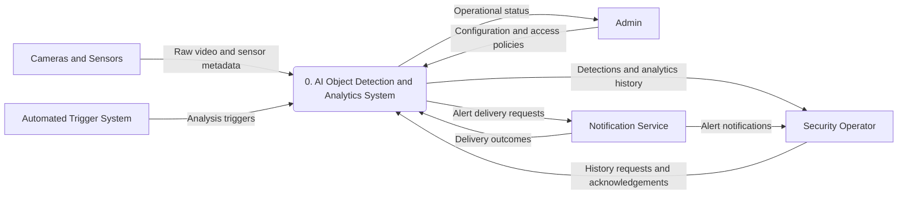
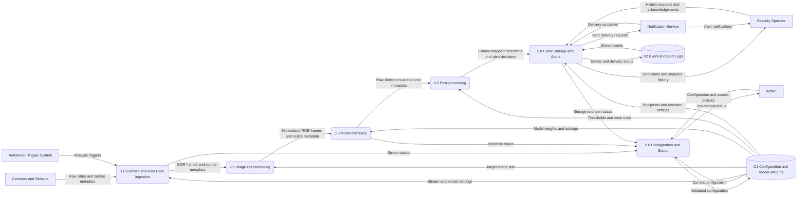

# Lab 02: System Requirements & Software Architecture for AI Projects

## System Overview

This specification presents requirements for a Smart Automated Attendance System and a software design for an AI-powered surveillance application. Attendance and surveillance are separate use cases: attendance requires identity matching, while the surveillance design detects objects and generates analytics events. Object detection alone does not establish a person's identity.

The surveillance system receives camera streams, prepares frames, runs an object detection model, filters results, stores events, and sends alerts. The Python files are interface skeletons for future implementation. Numerical limits below are proposed lab design targets, not measured performance results.

## Task 1: Functional and Non-Functional Requirements

### Smart Automated Attendance System: Functional Requirements

| ID | Type | Requirement | Acceptance criterion |
| --- | --- | --- | --- |
| FR-01 | Functional | Allow an administrator to enroll a student with a unique ID and consented reference images. | A valid enrollment creates a retrievable student record; duplicate IDs are rejected. |
| FR-02 | Functional | Capture classroom images and identify enrolled students using a configurable matching threshold. | A match above the threshold returns a student ID; an uncertain or unknown face is flagged for review. |
| FR-03 | Functional | Record attendance with student ID, class session, and timestamp. | A recognized student receives exactly one attendance record per session despite repeated frames. |
| FR-04 | Functional | Allow an authorized teacher to review and correct attendance records. | Each correction retains the previous value, editor identity, time, and reason. |
| FR-05 | Functional | Generate attendance reports by class, student, and date range. | An authorized user can view matching records and export them as CSV. |

### Smart Automated Attendance System: Non-Functional Requirements

| ID | Type | Requirement | Acceptance criterion |
| --- | --- | --- | --- |
| NFR-01 | Non-functional: Performance | Complete attendance processing within 3 seconds per submitted frame on the declared lab hardware. | At least 95% of frames in a 100-frame benchmark meet the limit. |
| NFR-02 | Non-functional: Accuracy | Achieve at least 95% precision and 90% recall for identity matches on a consented, held-out classroom dataset. | Report precision and recall using a documented threshold and test dataset. |
| NFR-03 | Non-functional: Security and privacy | Restrict biometric data to authorized roles and encrypt it in transit and at rest. | Role-based access tests deny unauthorized requests; deployed storage and transport encryption are verified. |
| NFR-04 | Non-functional: Reliability | Preserve committed attendance records after a service restart. | Restarting the service does not lose or duplicate previously committed records. |
| NFR-05 | Non-functional: Maintainability | Separate capture, preprocessing, inference, and logging through documented typed interfaces. | Each module can be replaced by a compatible implementation without changing the other module interfaces. |

## Task 2: System Boundary, User Personas, and Input/Output Mapping

### Boundary

Inside the surveillance boundary are stream ingestion, preprocessing, inference, post-processing, event storage, alert delivery, and analytics queries. External entities are cameras and sensors, the Security Operator, the Admin, the Automated Trigger System, and the notification service. Camera hardware, model training, and human incident response are outside the boundary. Local model weights are supplied to the system; training is a separate activity.

### Actors and User Personas

| Actor | Persona or role | Interaction with the system |
| --- | --- | --- |
| Security Operator | A monitoring user who needs timely evidence to assess incidents. | Views detections and event history, receives alerts, and submits acknowledgements. |
| Admin | A technical user responsible for configuration and access. | Configures cameras, model selection, thresholds, zones, retention, and user permissions. |
| Automated Trigger System | An external scheduler or sensor controller. | Sends timestamped motion or scheduled analysis triggers with a camera ID. |
| Cameras and Sensors | External video and environmental devices. | Supply RTSP video, frame metadata, and sensor readings. |
| Notification Service | An external delivery provider. | Receives alert requests and returns delivery outcomes. |

### Inputs

| Input | Source | Format or parameters | Purpose |
| --- | --- | --- | --- |
| Video stream | Camera | RTSP URL; decoded uint8 BGR frames | Supply raw visual data. |
| Frame metadata | Camera or ingestion stage | Camera ID, timezone-aware timestamp, width and height in pixels, FPS | Associate detections with their source and original resolution. |
| Sensor parameters | Sensors or Automated Trigger System | Sensor ID, camera ID, motion flag, sensitivity in [0, 1], timestamp | Request or condition analysis. |
| Model and preprocessing configuration | Admin | Local weights path; target width and height; confidence threshold in [0, 1] | Control image preparation and inference. |
| Alert and access configuration | Admin | Detection classes, zones, recipients, roles, retention period | Control notification rules and authorized access. |
| Review requests | Security Operator | Event filters and event acknowledgement | Retrieve history and record operator review. |

### Outputs

| Output | Destination | Format or content | Purpose |
| --- | --- | --- | --- |
| Processed detections | Security Operator and event storage | Label, confidence, box (x_min, y_min, x_max, y_max) in original-frame pixels | Describe detected objects. |
| Alert notification | Notification Service and Security Operator | Event ID, camera ID, timestamp, rule, message | Support incident assessment. |
| Log entry | Event storage | Event ID, camera ID, timestamp, labels, boxes, confidences, delivery status | Preserve traceable analytics events. |
| Analytics history | Security Operator | Filtered stored events and counts by class or time interval | Support monitoring and review. |
| Operational status | Admin | Connection state, errors, dropped-frame count, resource usage | Support configuration and troubleshooting. |

### Operational Constraints

| Constraint | Proposed lab limit or assumption | Design response |
| --- | --- | --- |
| Memory footprint | Maximum 2 GB process memory for one camera, including model and frame buffers | Use a bounded frame queue and discard stale frames; verify memory on the chosen model and hardware. |
| Bandwidth | Maximum 4 Mbps per RTSP camera; one camera in the lab prototype | Configure stream bitrate and resolution; report connection interruptions. |
| Resolution and processing rate | Source up to 1920 x 1080; resize to 640 x 640; analyze up to 5 frames per second | Sample frames and carry original dimensions for coordinate mapping. |
| Compute and latency | Declare CPU/GPU and model; target 95th-percentile ingestion-to-stored-event latency of 2 seconds | Benchmark the complete pipeline and adjust model size or sampling rate. |
| Storage and privacy | Retain event metadata for 30 days; do not retain raw video by default | Apply retention cleanup and role-based access in the future implementation. |
| Connectivity | Camera or notification service may be temporarily unavailable | Reconnect cameras, record failures, and use bounded alert retries linked to event IDs. |

## Task 3: Data-Flow Diagrams

### Level 0: Context DFD

### Level 1: Internal DFD

### DFD Explanation

Rectangles represent external entities, rounded nodes represent processes, and cylinders represent data stores. Labeled arrows show data flows. Mermaid flowcharts provide a readable DFD notation on GitHub. Level 0 represents the complete system as one process; Level 1 expands it while preserving its external inputs and outputs. Internal storage appears at Level 1.

1. Ingestion decodes camera data and associates each selected frame with camera ID, timestamp, original dimensions, and sensor context.
2. Preprocessing directly resizes the frame and converts BGR uint8 pixels to normalized RGB float32 data. Source metadata travels alongside the image through the future pipeline coordinator.
3. Inference loads supplied weights and produces labels, confidence scores, and boxes in resized-image coordinates.
4. Post-processing applies confidence filtering and non-maximum suppression, maps boxes to original-frame pixels, and evaluates zone and class rules. For direct resizing, x coordinates scale by original_width / target_width and y coordinates by original_height / target_height.
5. Storage and alerts persist processed events, retrieve history, record acknowledgements, and deliver rule-approved alerts. Delivery outcomes are stored with their event IDs.
6. Configuration and status validates administrator settings and reports pipeline health. These processes are planned architecture responsibilities; their full implementations are outside this interface exercise.

## Task 4: Modular Software Architecture Blueprint

### Class and Module Summary

| Module and class | Responsibility | Inputs | Expected outputs | Python interface |
| --- | --- | --- | --- | --- |
| DataIngestion | Connect to a camera, read decoded frames, and release the connection | RTSP URL | Connection success, optional BGR frame, or no return value | [src/data_ingestion.py](src/data_ingestion.py) |
| ImagePreprocessor | Resize frames and normalize RGB pixels | BGR frame and (width, height) target size | RGB float32 NumPy array in [0, 1] | [src/image_preprocessor.py](src/image_preprocessor.py) |
| ModelInferenceEngine | Load model weights and return raw detections | Local weights path or normalized image | No return value on load; list of Detection records on prediction | [src/model_inference_engine.py](src/model_inference_engine.py) |
| AlertLogger | Persist processed detections and deliver approved alerts | Camera ID, timestamp, aligned detection lists; event ID, message, recipient | Stored event ID or delivery success | [src/alert_logger.py](src/alert_logger.py) |

### Method Contracts

| Class | Typed method signature | Return meaning |
| --- | --- | --- |
| DataIngestion | `connect(source_url: str) -> bool` | True if the camera connection succeeds. |
| DataIngestion | `read_frame() -> Optional[np.ndarray]` | H x W x 3 uint8 BGR frame; None when unavailable. |
| DataIngestion | `close() -> None` | Releases the connection. |
| ImagePreprocessor | `preprocess(frame: np.ndarray, target_size: Tuple[int, int]) -> np.ndarray` | Target-height x target-width x 3 normalized RGB float32 array. |
| ModelInferenceEngine | `load_model(weights_path: str) -> None` | Loads local model weights. |
| ModelInferenceEngine | `predict(image: np.ndarray) -> List[Detection]` | Raw detections; an empty list means no detections. |
| AlertLogger | `log_event(camera_id: str, timestamp: datetime, labels: List[str], bounding_boxes: List[Tuple[float, float, float, float]], confidences: List[float]) -> str` | Persistent event ID. |
| AlertLogger | `send_alert(event_id: str, message: str, recipient: str) -> bool` | True if delivery succeeds. |

`Detection` is a dataclass defined in the inference file. Its fields are `label: str`, `confidence: float`, and `bounding_box: Tuple[float, float, float, float]`. Box order is `(x_min, y_min, x_max, y_max)`. Raw inference boxes use resized-image pixels; logged boxes use original-frame pixels. Timestamps must be timezone-aware and logging lists must have equal lengths.

All operational methods deliberately raise `NotImplementedError`. This makes the files explicit interfaces without pretending to perform camera capture, inference, storage, or delivery. NumPy is already included in the repository dependencies; no dependency changes are needed.

### End-to-End Integration Plan

A future pipeline coordinator will retain frame metadata, call DataIngestion, pass frames through ImagePreprocessor and ModelInferenceEngine, and perform the post-processing described above. It will pass the resulting labels, mapped boxes, and confidences to AlertLogger, then call send_alert only when a configured rule is satisfied. Configuration management, history queries, acknowledgements, retention cleanup, and post-processing remain planned components beyond the four required skeleton files.

## Task 5: Design Scope and Validation

This document combines the requirements, system boundary, data flows, and module contracts into an end-to-end specification. Lab 01 files and its existing notebook remain outside the scope of Lab 02. The interface files can be syntax-checked without connecting to cameras or loading models. Functional execution and performance benchmarks are future work because the methods are intentionally unimplemented.
